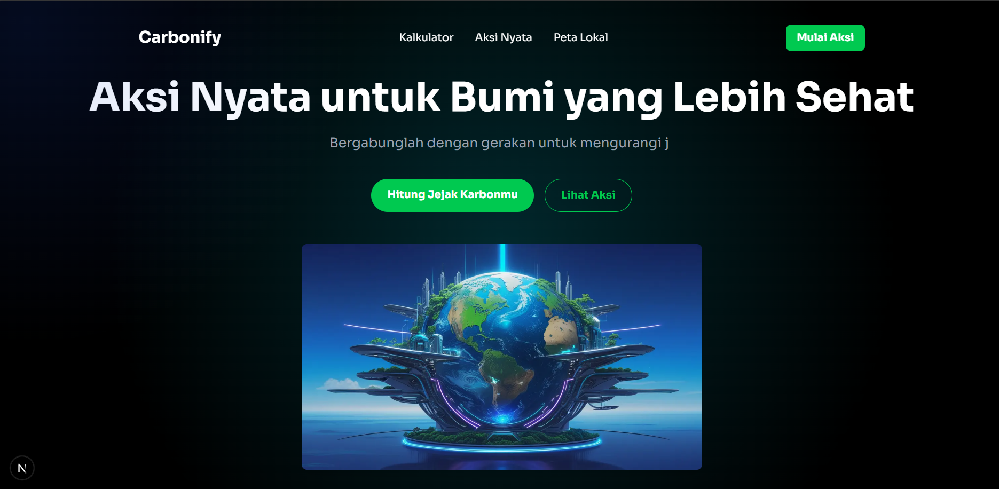

# 🌍 Carbonify - Jejak Karbon & Aksi Iklim

**Carbonify** adalah platform web interaktif yang dirancang untuk meningkatkan kesadaran tentang jejak karbon dan mendorong aksi nyata dalam menghadapi perubahan iklim. Proyek ini dibangun sebagai bagian dari **Technology Innovative Challenge 8.0** dengan tema "Impact World through Code: Building Solutions for Sustainable Development Goals".

[](https://your-live-demo-url.com) 
*(Ganti URL di atas dengan link Vercel Anda setelah deploy)*

 
*(Pastikan path gambar ini benar atau ganti dengan URL online)*

---

## ✨ Fitur Utama

-   **Desain Futuristik**: Antarmuka modern dengan tema Aurora GeoGlow dan efek cahaya kursor yang interaktif.
-   **Kalkulator Karbon Dinamis**: Menghitung emisi berdasarkan data spesifik (lokasi, jenis kendaraan, dll) yang terhubung dengan backend Django.
-   **Gamifikasi**: Sistem poin dan leaderboard untuk memotivasi pengguna menyelesaikan tantangan ramah lingkungan.
-   **Otentikasi Google**: Kemudahan login dengan satu klik menggunakan akun Google.
-   **Peta Lokal Interaktif**: Peta berbasis Leaflet yang menunjukkan lokasi ramah lingkungan seperti bank sampah, thrift store, dll., dengan fitur pencarian dan filter radius.
-   **Desain Responsif**: Tampilan yang dioptimalkan untuk berbagai perangkat, dari desktop hingga mobile.

---

## 🛠️ Tech Stack & Tools

<table>
  <tr>
    <td align="center" width="96">
      <a href="https://nextjs.org/">
        
      </a>
      <br>Next.js
    </td>
    <td align="center" width="96">
      <a href="https://react.dev/">
        
      </a>
      <br>React
    </td>
     <td align="center" width="96">
      <a href="https://www.typescriptlang.org/">
        
      </a>
      <br>TypeScript
    </td>
    <td align="center" width="96">
      <a href="https://tailwindcss.com/">
        
      </a>
      <br>Tailwind CSS
    </td>
    <td align="center" width="96">
      <a href="https://www.djangoproject.com/">
        
      </a>
      <br>Django
    </td>
    <td align="center" width="96">
        <a href="https://leafletjs.com/">
            
        </a>
        <br>Leaflet.js
    </td>
    <td align="center" width="96">
      <a href="https://www.framer.com/motion/">
        
      </a>
      <br>Framer Motion
    </td>
     <td align="center" width="96">
      <a href="https://prettier.io/">
        
      </a>
      <br>Prettier
    </td>
  </tr>
</table>

---

## 🚀 Instalasi & Menjalankan Proyek

Proyek ini terdiri dari dua bagian: **frontend (Next.js)** dan **backend (Django)**.

### Backend (Django)
1.  **Masuk ke direktori backend:**
    ```bash
    cd django-next-project
    ```
2.  **Buat dan aktifkan virtual environment:**
    ```bash
    python -m venv venv
    .\venv\Scripts\activate
    ```
3.  **Install dependensi:**
    ```bash
    pip install -r requirements.txt
    ```
4.  **Jalankan server backend:**
    ```bash
    python manage.py runserver
    ```
    Backend akan berjalan di `http://127.0.0.1:8000`.

### Frontend (Next.js)
1.  **Buka terminal baru** dan masuk ke direktori frontend:
    ```bash
    cd carbonify-app
    ```
2.  **Install dependensi:**
    ```bash
    npm install
    ```
3.  **Jalankan server pengembangan:**
    ```bash
    npm run dev
    ```
    Frontend akan berjalan di `http://localhost:3000`.

---

Dibuat dengan semangat untuk bumi yang lebih baik. 💚