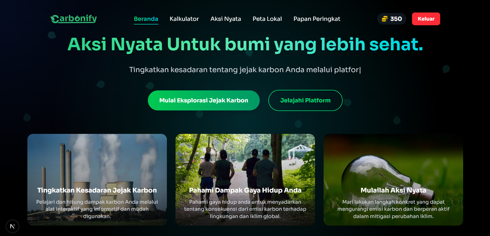

# 🌍 Carbonify - Jejak Karbon & Aksi Iklim

**Carbonify** adalah platform web interaktif yang dirancang untuk meningkatkan kesadaran masyarakat terhadap emisi karbon pribadi dan mendorong aksi nyata dalam menghadapi perubahan iklim. Proyek ini dikembangkan sebagai solusi inovatif berbasis teknologi untuk mendukung pencapaian **Sustainable Development Goals (SDGs)**, khususnya dalam konteks **keberlanjutan lingkungan dan transformasi digital di Indonesia**.

[](https://www.greenifycarbon.tech/) 



---

## ✨ Fitur Utama

-   **Desain Futuristik & Interaktif**: Antarmuka modern dengan tema Aurora, efek cahaya kursor, animasi daun jatuh, dan globe 3D interaktif di halaman utama.
-   **Kalkulator Karbon Dinamis**: Menghitung estimasi emisi karbon bulanan berdasarkan data spesifik (lokasi, jenis kendaraan, bahan bakar, dll) yang terhubung langsung ke backend Django.
-   **Gamifikasi & Keterlibatan Pengguna**: Sistem poin, lencana, dan tantangan mingguan dengan bukti unggah foto untuk memotivasi pengguna.
-   **Papan Peringkat (Leaderboard)**: Menampilkan peringkat pengguna dengan skor tertinggi secara *real-time* untuk mendorong kompetisi yang sehat.
-   **Otentikasi Google & Profil Pengguna**: Kemudahan login dengan satu klik menggunakan akun Google, lengkap dengan halaman profil personal yang menampilkan statistik, lencana, dan riwayat aksi.
-   **Peta Lokal Interaktif**: Peta berbasis Leaflet yang menunjukkan lokasi ramah lingkungan (Bank Sampah, Thrift Store) dengan fitur pencarian dan filter radius.

---

## 🛠️ Tech Stack & Tools

<table>
  <tr>
    <td align="center" width="96">
      <a href="https://nextjs.org/">
        
      </a>
      <br>Next.js
    </td>
    <td align="center" width="96">
      <a href="https://react.dev/">
        
      </a>
      <br>React
    </td>
     <td align="center" width="96">
      <a href="https://www.typescriptlang.org/">
        
      </a>
      <br>TypeScript
    </td>
    <td align="center" width="96">
      <a href="https://tailwindcss.com/">
        
      </a>
      <br>Tailwind CSS
    </td>
    <td align="center" width="96">
      <a href="https://www.djangoproject.com/">
        
      </a>
      <br>Django
    </td>
    <td align="center" width="96">
        <a href="https://leafletjs.com/">
            
        </a>
        <br>Leaflet.js
    </td>
    <td align="center" width="96">
      <a href="https://lottiefiles.com/">
        
      </a>
      <br>Lottie
    </td>
     <td align="center" width="96">
      <a href="https://prettier.io/">
        
      </a>
      <br>Prettier
    </td>
  </tr>
</table>

---

## 🚀 Instalasi & Menjalankan Proyek

Proyek ini terdiri dari dua bagian: **frontend (Next.js)** dan **backend (Django)**. Keduanya harus dijalankan secara bersamaan.

### Backend (Django)
1.  **Masuk ke direktori backend:**
    ```bash
    cd django-next-project
    ```
2.  **Buat dan aktifkan virtual environment:**
    ```bash
    python -m venv venv
    .\venv\Scripts\activate
    ```
3.  **Install dependensi:**
    ```bash
    pip install -r requirements.txt
    ```
4.  **Jalankan migrasi database:**
    ```bash
    python manage.py migrate
    ```
5.  **Jalankan server backend:**
    ```bash
    python manage.py runserver
    ```
    Backend akan berjalan di `http://127.0.0.1:8000`.

### Frontend (Next.js)
1.  **Buka terminal baru** dan masuk ke direktori frontend:
    ```bash
    cd carbonify-app
    ```
2.  **Install dependensi:**
    ```bash
    npm install
    ```
3.  **Buat file `.env.local`** dan isi dengan Google Client ID Anda:
    ```
    NEXT_PUBLIC_GOOGLE_CLIENT_ID=YOUR_GOOGLE_CLIENT_ID
    ```
4.  **Jalankan server pengembangan:**
    ```bash
    npm run dev
    ```
    Frontend akan berjalan di `http://localhost:3000`.

---
